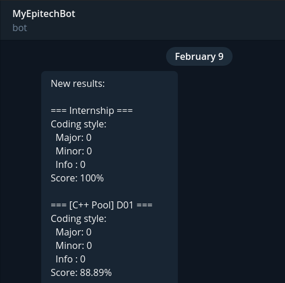
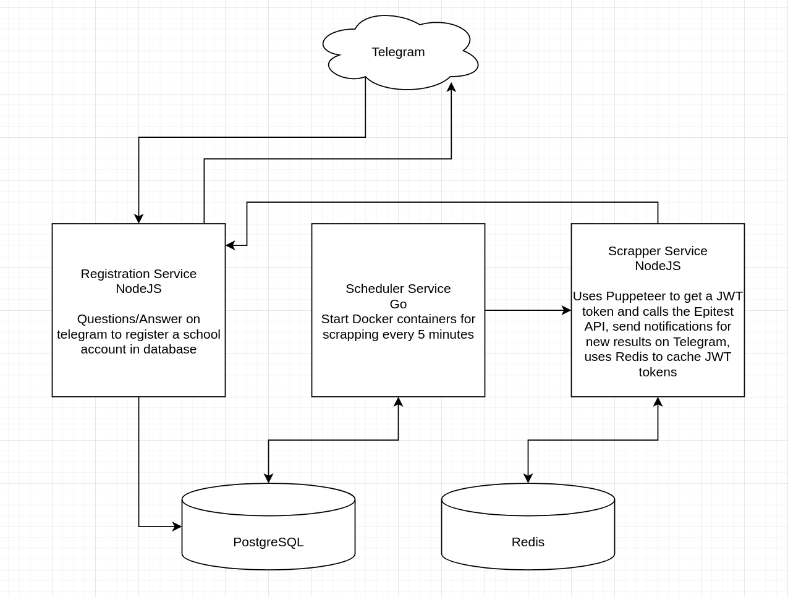

# My Epitech - Telegram Bot

This repository contains a Telegram bot which notifies for new results on my.epitech.eu.
It is intended for Epitech students.

## Architecture:

This project is composed of 3 services:

- Registration Bot service:

  This Node JS server handles everything related to the Telegram API. It handles the registration part on the bot which can be triggered with the `/start` command. Questions are then asked to the user and answers are stored in the PostgreSQL database. It also exposes an internal HTTP server which can be used to send messages to a Telegram's user. All sensitive data in ciphered with AES.

- Scheduler service:

  This Golang service uses the Docker SDK to run a Scrapper container for every user registered in the PostgreSQL database every 5 minutes.

- Scrapper service:

  This Node JS service uses Puppeteer to get a my.epitech.eu JWT token. It uses Redis to cache these tokens as they are valid for about an hour. Then, it sends a request to the Epitest API using this token. Finally, if there are new results, it sends a request to the Registration Bot service in order to notify the user.

## Setup

Everything is Dockerized. There are 2 images to start in order to run the bot. Here are the environment variables available:

- Registration Bot service:

  ​      \- `NODE_ENV` should be `production`

  ​      \- `NTBA_FIX_319` should be `True`

  ​      \- `TELEGRAM_TOKEN` should be your Telegram bot's token

  ​      \- `DB_HOST` should be your Postgres host

  ​      \- `DB_NAME` should be your Postgres database name

  ​      \- `DB_USER` should be your Postgres username

  ​      \- `DB_PASSWORD` should be your Postgres password

- Scheduler service:

  ​      - `NODE_ENV` should be `production`

  ​      \- `ENV` should be `production`

  ​      \- `SCRAP_IMAGE` should be the name and tag of the scrapper's image (example: `my-scrapper:latest`)

  ​      \- `SCRAP_NETWORK` can be set in order to make the scrappers' containers join a Docker network

  ​      \- `DB_HOST` should be your Postgres host

  ​      \- `DB_NAME` should be your Postgres database name

  ​      \- `DB_USER` should be your Postgres username

  ​      \- `DB_PASSWORD` should be your Postgres password

  ​      \- `DB_SSL` can be set to `disable` in order to disable Postgres SSL mode

  ​      \- `MESSAGE_ENDPOINT` should the the endpoint to the registration service (example: `http://registration:8080/send`)

  ​      - `REDIS_URL` should be the URL to the Redis server (example: `redis://cacheServer:6379`)

